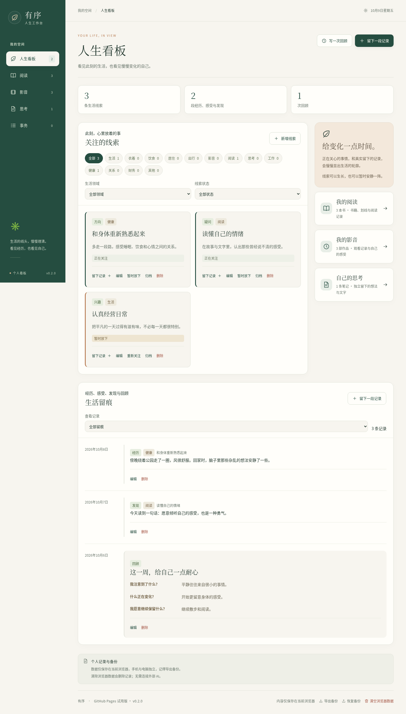

# 有序 · 人生工作台

**把生活的线头慢慢理清，看见经历，也看见自己。**

有序是一款面向 iPhone 和电脑的中文个人人生应用。用一个看板整理正在关注的生活线索、经历、感受与发现，把阅读、影音、思考和日常事务放进同一个个人空间，帮助回顾、自省、自我发现与成长。

兴趣可以暂时没有目标，经历可以只是值得回味，疑问也可以留着继续想。事务是其中一项工具；阅读、观影与生活感受都有自己的位置，不要求转化成待办。

[打开网页](https://templehao.github.io/codex/) · [查看版本发布](https://github.com/TempleHao/codex/releases) · [更新记录](CHANGELOG.md) · [使用与部署文档](#文档导航) · [反馈问题](https://github.com/TempleHao/codex/issues)

当前软件版本：**v0.4.0**，持续开发中。网页侧栏和页脚显示当前部署版本；备份格式的 v2 是数据格式编号，与软件版本独立。

## 可以用它做什么

| 空间 | 当前功能 | 适合留下的内容 |
| --- | --- | --- |
| 人生看板 | 生活线索、经历感受与发现、回顾；按领域和状态筛选；支持暂放与归档 | 最近的牵挂、兴趣、变化，以及想继续理解的疑问 |
| 阅读 | 默认展示封面的书架、阅读状态、书籍与摘录、本人想法、阅读时长和年度热力图；偶然重逢随机回顾；JSON 导入；可选微信读书同步 | 读过的书、触动自己的句子、阅读习惯 |
| 影音 | 回顾、片单、感想；电影和整部剧各占一张卡；分季查看单集和重看；年度观看足迹；Trakt 授权与自动刷新 | 看过或想看的作品、观看记录、自己的感受 |
| 思考 | 独立记录、新建编辑、搜索；博客「说说」只读归档与搜索；可选关联书籍和摘录 | 尚未成形的想法、感受、观点变化，以及旧日文字 |
| 事务 | 今天、收件箱、全部待办、已完成；计划日与截止日；聊天整理结果预览后批量导入 | 需要处理的安排、琐事与具体行动 |

生活领域涵盖衣着、饮食、居住、出行、影音、阅读、思考、工作、健康、关系、财务等。这些目前用于整理线索与记录；健康监测、记账、旅行规划等专用工具尚未实现。

界面采用暖纸白、深绿与陶土色，搭配中文标题和书刊式卡片。手机使用底部导航，电脑使用侧栏。使用本机字体，不加载第三方字体或统计脚本；日期按 `Asia/Shanghai` 解释。

### 页面示例

以下截图使用虚构演示资料，不会自动写入你的记录。个人工作台记录初始为空；公开博客归档会按需从本站读取。



[查看 iPhone 宽度的看板截图](docs/assets/life-board-mobile.png)

## 第一次使用

1. [打开有序](https://templehao.github.io/codex/)，在「人生看板」新增一条当前关注的线索，或留下一段经历、感受与发现。
2. 在「阅读」「影音」「思考」中添加内容。微信读书与 Trakt 都是可选连接，手动记录也可以使用。
3. 隔一段时间点「写一次回顾」，回看自己注意到了什么、什么正在变化、有什么愿意保留。
4. 使用页脚「导出备份」保存完整 JSON；换设备时在另一台设备「恢复备份」。手机和电脑的记录不会自动互相同步。

iPhone 可以在 Safari 的分享菜单选择「添加到主屏幕」。图标和应用清单已提供，目前还没有整站离线使用和后台提醒。

### 微信读书

通过 GitHub Actions 读取官方接口，把阅读资料加密后随 Pages 发布。首次在网页解锁、预览并保存时可勾选本设备自动解锁；只在 IndexedDB 保存不可导出的 PBKDF2 CryptoKey，不保存口令或 API Key。API Key 放在仓库 Secrets，不进入网页。

本仓库的阅读快照属于部署者。其他使用者需要 Fork 并配置自己的 `WEREAD_API_KEY` 和 `WEREAD_SYNC_PASSPHRASE`，或者手动导入阅读 JSON。GitHub Actions 每 3 小时尝试刷新云端快照，笔记也会同步；调度可能延迟或长期无活动后停用。开启本机自动解锁后，每次打开应用会读取最近发布的快照并合并。书架、统计及笔记的可用范围由官方接口和账号实际返回决定。

详见 [免费同步配置](docs/GITHUB_READING_SYNC.md)与[阅读数据格式和统计口径](docs/WECHAT_READING.md)。

### 偶然重逢：让读过的文字回来

首页「偶然重逢」可在全部、阅读或思考来源中随机回看；阅读页也可单独回顾阅读笔记。每次打开应用重新抽取，同一次打开切换页面会保持当前内容。各来源可筛选，阅读与思考分别完成一轮后才重复。

卡片标明来源及已有日期。阅读卡片保留书名和章节，思考卡片可跳转查看来源；它只使用已保存的内容，不生成新文字、待办或已读状态，也不改写原文。详见 [阅读回顾说明](docs/READING_REVISIT.md)。

### 博客与思考

思考页汇集 2020-03-24 至 2026-10-08 的 1646 条博客「说说」，提供全部、随手写、博客来源筛选、年份筛选、搜索和每页 40 条浏览。原文只读；可以另存此刻感受，并保留对应来源。博客资料单独缓存在本机，不进入完整生活备份；网站打开时从同站点获取最新公开同步文件。详见 [博客与思考](docs/BLOG_THOUGHTS.md) 与 [自动更新](docs/AUTOMATIC_UPDATES.md)。

### Trakt 影音

在 Trakt 创建自己的开发者应用，填写当前网页显示的回调地址、CORS 来源和公开 Client ID，然后点击「跳转 Trakt 授权」。使用 PKCE，不需要在网页填写 Client Secret。首次预览确认后，在此浏览器记住连接；后续打开页面时自动读取观看历史、想看片单和本人评分，并续期授权。

每部电影或剧集在片单只显示一张卡，单集与重看保留在分季详情中。海报优先使用 Trakt 原生图片，缺少时尝试公开备用图源，并在本机缓存；图片仍可能受来源缺图或网络限制影响，可查看具体作品的诊断。个人感想会在合并时保留，应用不会修改 Trakt 上的记录。标题按返回值展示，没有提供的中文译名不会自动猜测。

配置步骤与统计方式见 [Trakt 影音接入](docs/TRAKT.md)。

### 从聊天收集事务

把一大段事情告诉聊天助手，请它按 [聊天收集约定](docs/CHAT_CAPTURE.md)整理成 JSON。将结果粘贴到事务收件箱，点击「预览」，逐条调整或取消勾选，再批量保存。

网页本身没有接入外部 AI，也不会自动读取聊天。粘贴自然语言时只按行收集；复杂段落由聊天助手先整理。日期不明确时需要确认，周期任务尚不会自动重复。每批最多 100 条。

## 数据保存与隐私

**GitHub 仓库存代码，Pages 发布网页，个人记录默认保存在当前浏览器。**

| 内容 | 保存或传输位置 |
| --- | --- |
| 人生看板、阅读、影音、网页新增思考、事务及原文 | 当前设备与浏览器的本地存储，完整工作台不上传 GitHub |
| 博客说说原文 | 独立 IndexedDB 缓存；从本站公开的 blog-sync.json 读取，不进入生活备份 |
| 完整 JSON 备份 | 你手动下载的文件；可用于设备间移交，建议定期保存 |
| 可选微信读书同步 | Actions 请求官方接口，Pages 发布加密阅读快照；首次解锁后可选择在本设备保存非导出的解锁密钥，之后自动读取并合并最新快照 |
| 可选 Trakt 连接 | 浏览器直接请求官方授权与资料接口；连接单独保存在本机，不包含在备份里 |
| 书籍封面和影音海报 | 请求相应公开图片来源；影音海报另有本机缓存 |

清除网站数据、更换浏览器或网址会影响记录可用性。当前没有账号、完整工作台的跨设备自动同步或自动定时备份；共用设备上同一浏览器的使用者可以看到本机记录。博客归档可以从公开站点重新读取，微信读书快照只覆盖阅读资料，不能替代完整备份。

完整备份使用 `life-workbench-backup` v2，兼容原有 v1 待办备份，最多 20 MB。恢复采用补回记录的方式，冲突时整次失败并保留现有内容；阅读与影音的专用导入采用各自的合并规则。完整口径和 SQLite 备份方式见 [数据与备份](docs/DATA_AND_BACKUPS.md)。请勿将私密备份、密钥或原始个人资料提交到公开仓库、Issue 或 PR。

## 只用 GitHub 免费部署

Fork 本仓库，在 **Settings → Pages → Source** 选择 **GitHub Actions**，将代码推送到 `main`，或运行 **Actions → Publish GitHub Pages**。GitHub Free 的公开仓库可以使用 Pages，不需要购买服务器、域名或 AI 服务。微信读书 Secrets 和 Trakt 连接均为可选。

代码发布工作流校验版本记录、检查类型、运行单元测试、构建静态站点、部署网页，再发布对应的 GitHub Release。独立数据工作流每 3 小时更新阅读与博客资料，复用同一提交已构建的网页 artifact；没有可用 artifact 时会触发仅同步部署，不发布新版本。定时调度可能延迟或因长期无活动停用，不保证永远运行。仓库名变化时，部署路径与快照地址由 Pages 配置提供。

完整步骤见 [GitHub Pages 发布指南](docs/GITHUB_PAGES.md)，日常数据刷新见 [自动更新说明](docs/AUTOMATIC_UPDATES.md)。GitHub 与外部资料来源在中国大陆的访问速度和可用性取决于实际网络，GitHub 的免费额度与政策仍然适用。

## 本地开发

需要 **Node.js 24+**、npm，以及用于浏览器测试的 Chromium。请在仓库根目录执行：

```sh
git clone https://github.com/TempleHao/codex.git
cd codex
npm ci --ignore-scripts
```

### 与线上一致的静态版

```sh
LIFE_BASE_PATH=/codex npm run build:preview
npm run serve:preview
```

静态产物在 `preview-out/`，本地地址以启动日志为准。构建在临时目录完成，不包含服务端 API、密钥或明文个人记录。使用根路径部署时将 `LIFE_BASE_PATH` 设为空字符串；线上工作流自动读取 Pages 的路径。

### 本地 SQLite 开发版

```sh
npm run dev
```

默认绑定 `127.0.0.1:3000`，服务端数据放在 `.data/life.sqlite`，可用 `LIFE_DATA_DIR` 指定目录。这条开发路径与 Pages 浏览器存储不同，尚无登录和多用户隔离，请勿直接暴露到公网。生产构建命令为 `npm run build` 和 `npm start`。

### 验证命令

```sh
npm run release:check
npm run typecheck
npm test
LIFE_BASE_PATH=/codex npm run build:preview
npm run test:preview
```

`npm run test:e2e` 用于本地服务端版本。浏览器测试默认使用 `/usr/bin/chromium`，可通过 `CHROMIUM_PATH` 指定安装位置。测试使用独立浏览器、临时数据和虚构资料，不读写个人数据库；静态版的旧图片缓存升级测试会临时替换测试产物中的 worker 文件，并在结束时恢复。

## 技术与目录

基于 Next.js 16、React 19、TypeScript 与 Zod；使用 Vitest 和 Playwright 验证。线上采用静态导出，微信读书读取运行于 GitHub Actions，本地开发版另提供 SQLite 接口。`package.json` 的 `private: true` 表示不发布 npm 包，不影响网页部署。

```text
app/                 页面、全局样式、本地开发 API
components/          人生看板、阅读、影音、思考与连接界面
lib/                 数据校验、合并、备份、第三方接口和浏览器存储
scripts/             静态构建、阅读同步、图片诊断和版本发布
tests/               浏览器端到端验证
docs/                产品方向、使用、接入、部署与发布说明
.github/workflows/   GitHub Pages 部署与诊断
CHANGELOG.md         每个软件版本的更新记录
```

## 文档导航

| 文档 | 内容 |
| --- | --- |
| [产品方向](docs/PRODUCT_DIRECTION.md) | 人生线索、经历、自省与成长的设计原则 |
| [GitHub Pages](docs/GITHUB_PAGES.md) | 免费部署、Fork、自定义路径和故障排查 |
| [微信读书同步](docs/GITHUB_READING_SYNC.md) | 两个 Secret、加密快照、定时读取与解锁 |
| [阅读回顾](docs/READING_REVISIT.md) | 随机回看划线与自己的想法、定位原笔记 |
| [博客与思考](docs/BLOG_THOUGHTS.md) | 博客「说说」归档、只读原文、搜索与来源感受 |
| [自动更新](docs/AUTOMATIC_UPDATES.md) | 阅读、博客与 Trakt 的云端及本机刷新机制 |
| [阅读资料](docs/WECHAT_READING.md) | 官方 Skill、数据格式、统计口径与能力边界 |
| [Trakt 影音](docs/TRAKT.md) | 跳转授权、自动刷新、作品归并与海报 |
| [聊天收集](docs/CHAT_CAPTURE.md) | 聊天整理结果的 JSON 与清单约定 |
| [数据与备份](docs/DATA_AND_BACKUPS.md) | 完整备份、恢复冲突和跨设备移交 |
| [贡献说明](CONTRIBUTING.md) | 提交问题、开发验证与资料保护 |
| [GitHub 仓库资料](docs/GITHUB_REPOSITORY.md) | About 简介、网址与主题的可填写内容 |
| [版本发布](docs/RELEASING.md) | 版本号、更新记录、不可移动的标签和自动 Release |

## 后续方向

希望逐步补充年度人生回顾、跨领域线索关联、兴趣变化，以及衣食住行、工作、健康等更丰富的记录方式。这些是后续方向，目前不代表已实现，也不据此生成心理标签或成长评分。会继续优先考虑中文、手机使用和免费部署。

反馈可以提交 [Issue](https://github.com/TempleHao/codex/issues)，并附上页面版本、设备、操作步骤和已经去除私人内容的提示信息。贡献前请阅读 [贡献说明](CONTRIBUTING.md)。

## 许可与资料来源

代码公开供查看与讨论，当前尚未选择并添加 `LICENSE`，因此不声明采用某项开源许可证。第三方书籍、封面、影视海报与用户资料的权利归相应权利人；接入微信读书、Trakt 和 GitHub 时需遵循各自的服务规则。
